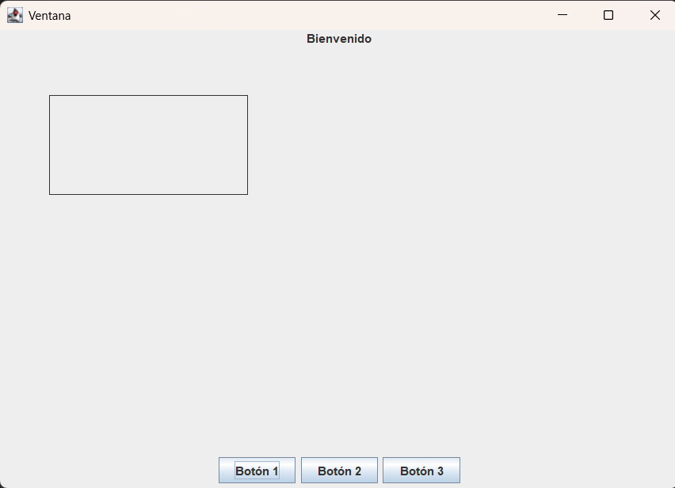
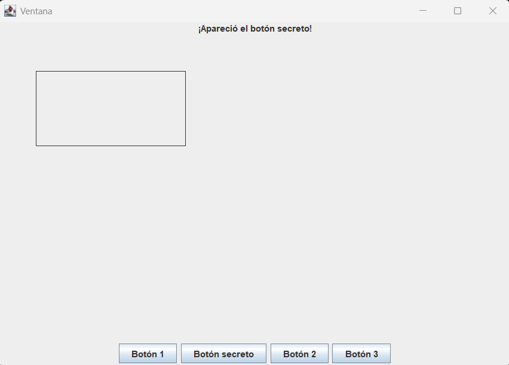
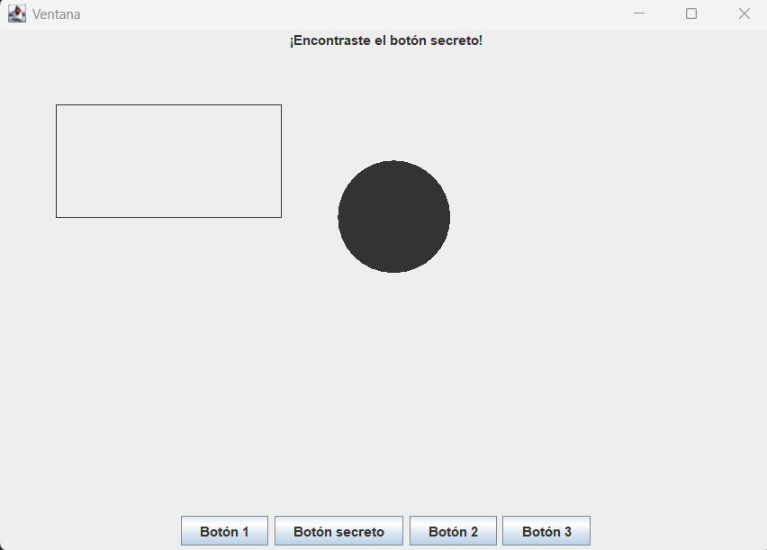

# Ayudantía 12

## Ejercicio 01

#### Haga ingeniería inversa para obtener la misma ventana que la de la foto.


#### Ventana al abrir


#### Ventana al presionar el botón 1


#### Ventana al presionar el botón secreto

#### Especificaciones:
<li> Tamaño de la ventana: 700 x 500 </li>
<li> La ventana se cierra y el código se detiene al cerrar. </li>
<li> 4 botones. Dos no hacen nada. Uno revela el botón invisible. El cuarto muestra un círculo en la posición 300x100 con mediciones 100x100 </li>
<li> Hay un rectángulo en la posición 50x50 de tamaño 200x100 </li>

####

## Ejercicio 02

#### Se guardaron los datos de un torneo de ajedrez y las estrategias que las personas tenían para cada uno de los movimientos. Se registró cada jugada de un partido en un mismo archivo llamado “jugadas.txt” con el siguiente formato:

```
Jugador (nombre);posición;pieza;come si/no;pieza que come;tiempo de jugada (segundos)
```

#### Sin embargo, los dueños del torneo se percataron de algo. Hay ciertas jugadas donde parecían que los jugadores cambiaban totalmente de estrategia para poder ganar. Estudiaron esas condiciones y encontraron lo siguiente: Los jugadores cambian a una estrategia defensiva cuando perdían 2 piezas seguidas. Se cambian a una estrategia agresiva cuando no habían comido ninguna pieza en 3 jugadas. Y comenzaban con una estrategia neutral que volvían a usar después de haber comido la reina del rival.

#### Luego de esta investigación, los dueños quieren que calcules las prioridades de cada jugador. Suponiendo que tienen un sistema de punteo de qué tan defensivo o agresivo está jugando un jugador, podemos evaluar los movimientos con los siguientes medidores: Agresividad (que sube cuando un jugador va a priorizar comer piezas o atacar por sobre defender), defensividad (que sube cuando un jugador va a priorizar proteger al rey u otras piezas por sobre atacar), y juego a largo plazo (que sube cundo un jugador hace movimientos neutrales para armar jugadas más adelante). Tenemos las siguientes calificaciones:

<li> Si una jugada en estrategia agresiva se come a una pieza, agresividad +5, largoPlazo +2. Si una jugada en estrategia neutral se come una pieza, largoPlazo +3, defensividad +1. Si una jugada en estrategia defensiva se come una pieza, defensividad +2, largoPlazo +1. </li>
<li> Si una jugada en estrategia agresiva no se come una pieza, agresividad +3, largoPlazo +2, defensividad +1. Si una jugada en estrategia neutral no se come una pieza, largoPlazo +5, defensividad +2. Si una jugada en estrategia defensiva no se come una pieza, defensividad +5, largoPlazo +2. </li>
<li> Si una jugada se demora más de 10 segundos, largoPlazo +5. </li>

#### Al final de todo, haga una ventana que le permita al usuario encontrar todas las estadísticas finales:

<ol>
<li> El tiempo total de juego de cada jugador.</li>
<li> El puntaje total de agresividad, defensividad y juego a largo plazo de ambos jugadores.</li>
<li> La cantidad de jugadas hechas con cada estrategia de ambos jugadores. </li>
<li> El porcentaje de cada estrategia de jugada respecto a las jugadas totales hechas. </li>
</ol>

#### Requerimientos:

<li> Debe cumplir con la estructura de sistema. </li>
<li> Debe usar el patrón Strategy. Es bienvenido a usar Visitor para dejar el código más limpio si lo estima necesario. </li>
<li> Tiene la libertad de hacer la ventana como quiera, siempre y cuando tenga los cuatro botones y muestre los resultados correspondientes. </li>

